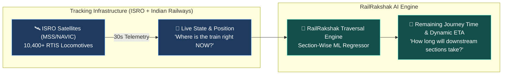
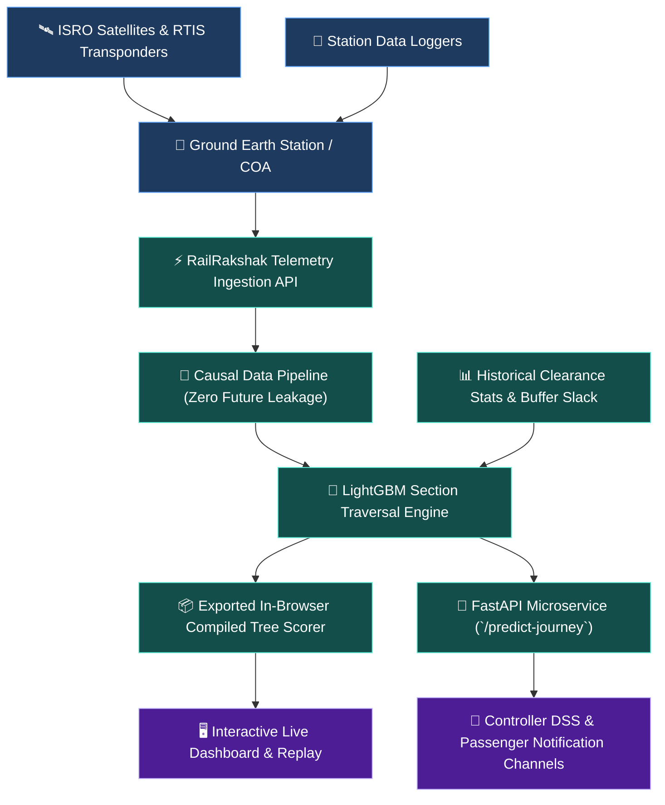

# RailRakshak

### Dynamic Train Journey Time Prediction Engine Built on ISRO RTIS Satellite Telemetry

> **RailRakshak** is a prediction intelligence system for Indian Railways. Rather than replacing existing satellite tracking infrastructure, RailRakshak builds the machine-learning prediction layer directly on top of ISRO RTIS (Real-Time Train Information System) 30-second locomotive telemetry to forecast remaining journey durations, section by section.

| 🛰️ Telemetry Input | 🧭 Corridor | 🧠 ML Engine | 🖥️ Frontend |
| :--- | :--- | :--- | :--- |
| ISRO RTIS / COA (30s GNSS) | SBC → MYS (Bengaluru–Mysuru) | LightGBM Section Regressor | React + Vite Dashboard & Simulation |

---

## 🎯 The Core Paradigm Shift



### What We Solve
- **Existing tracking answers:** *"Where is the train at timestamp $t$?"*
- **RailRakshak answers:** *"Given its live state, schedule buffer slack, and corridor congestion, how long will each remaining downstream section take to traverse?"*

Traditional systems carry forward current delays linearly ($\text{Final Delay} = \text{Current Delay}$). RailRakshak models non-linear delays, capturing buffer recovery on clear segments and cascading junction holdovers at bottleneck stations.

---

## 🗺️ Downstream Section Trajectory (SBC → MYS)

```text
KSR Bengaluru (SBC)
   │
   ├── Section 1 (SBC → KGI):  Cleared
   ├── Section 2 (KGI → BID):  Cleared
   ├── Section 3 (BID → RMGM): 🚆 LIVE (ISRO RTIS: Delay +12 min)
   │                           ────────────────────────────────────────
   │                           🔮 RailRakshak Predicts Downstream:
   ├── Section 4 (RMGM → CPT): Predicted: 18 min (Buffer recovery: -3 min)
   ├── Section 5 (CPT → MAD):  Predicted: 27 min (Junction bottleneck: +8 min)
   ├── Section 6 (MAD → MYA):  Predicted: 22 min (Normal run: +0 min)
   └── Section 7 (MYA → MYS):  Predicted: 35 min (Terminal platforming: +5 min)
                               ────────────────────────────────────────
                               Remaining Time: 102 min | Terminus ETA Delay: +22 min
```

---

## 🛠️ System Architecture



---

## 💻 Repository Structure

```text
RailRakshak
├── ml/                 Data collection, causal feature engineering, training & evaluation
├── backend/            FastAPI prediction microservice (REST endpoints)
├── src/                React dashboard, corridor simulation, HUD & interactive slides
├── data/               Cached raw telemetry payloads, processed datasets & provenance
├── models/             Trained LightGBM model, evaluation metrics and feature metadata
├── scripts/            Automated end-to-end pipeline reproduction scripts
└── config/             Pipeline configuration & corridor parameters
```

---

## 🚀 Running Locally

### 1. Start the React Frontend Dashboard
```powershell
npm install
npm run dev
```
Open `http://localhost:8080` in your browser.

### 2. Start the FastAPI Prediction Microservice (Optional)
```powershell
.\.venv\Scripts\Activate.ps1
uvicorn backend.main:app --reload --port 8000
```
API documentation is available at `http://localhost:8000/docs`.

### 3. Reproduce the Complete ML Pipeline
```powershell
python -m venv .venv
.\.venv\Scripts\Activate.ps1
pip install -r backend/requirements.txt

# Execute full pipeline
bash scripts/scrape.sh
python -m ml.preprocessing
python -m ml.feature_engineering
bash scripts/train.sh
python -m ml.export_artifacts
```

---

## 📊 Evaluation & Measured Metrics

RailRakshak is validated on chronologically held-out test journeys across Vande Bharat, Shatabdi, Express, and Passenger trains on the Bengaluru–Mysuru line:

- **Section-Level MAE:** Evaluated per track block.
- **Client-Side Scorer Parity:** In-browser JSON decision trees match the Python booster output to $< 10^{-5}$ minutes.
- **Strict Causality:** Features include only past information available at the instant of departure from each station.

---

## 📜 Disclaimer

RailRakshak is an independent research prototype developed for educational and hackathon purposes. It is not affiliated with Indian Railways, CRIS, or ISRO. Predictions are statistical estimates and must not be used for railway safety or dispatch-critical operations.
