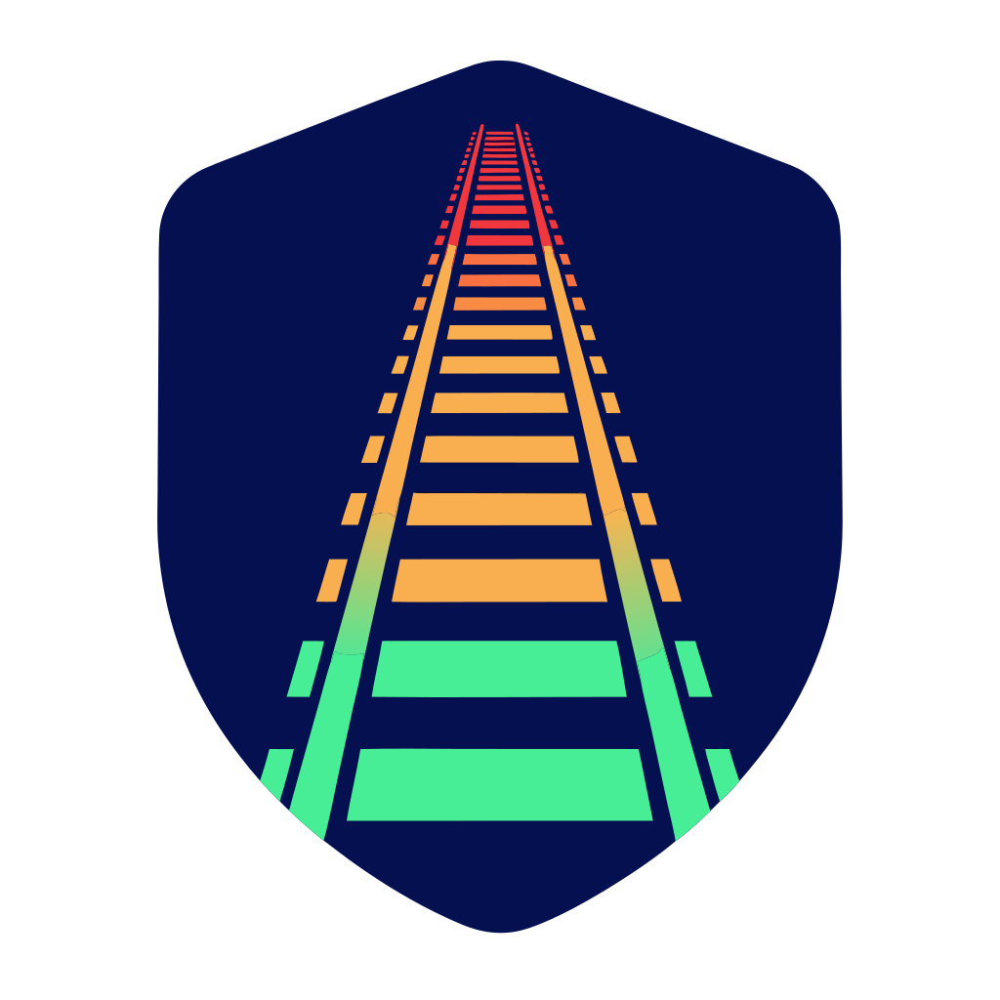

<div align="center">
  
  <h1>🚆 RailRakshak · Rail Insight</h1>
  <p><strong>Next-Generation Railway Dispatch Intelligence, Dynamic Multi-Factor ETA &amp; Kinematic Corridor Simulation Platform</strong></p>
  <p><em>Smart India Hackathon (SIH 2026) · South Western Railway (SWR) Corridor (Mysuru ➔ KSR Bengaluru · 138.25 km)</em></p>

  <p>
    
    
    
    
    
    
    
  </p>
</div>

---

## 💡 Core Idea & Problem Statement

### The Flaw in Traditional Railway Tracking
Traditional railway systems calculate train delays naively:
$$\text{Predicted Arrival} = \text{Booked Schedule} + \text{Current Live Delay}$$

This static linear addition fails to reflect real-world railway physics:
- It ignores **preceding train headway compression** (e.g., trailing behind a slow 54-wagon freight rake under Double Yellow / Yellow signal cascades).
- It ignores **locomotive power-to-weight ratios** and **historical tractive recovery capacity** (a Vande Bharat trainset can reclaim 88% of potential slack, whereas a 17-halt MEMU can only reclaim 22%).
- It fails to anticipate **downstream bottleneck clusters** (e.g., Kengeri–SBC terminal throat reception cross-overs or Mandya commuter surges).
- It cannot advise drivers and section controllers on the **exact pace ($V_{\text{target}}$)** required on clear sections to make up lost time.

---

### The Solution: RailRakshak 2.0
**RailRakshak** is a **Dual-Core Kinematic & Physics-Informed ML Intelligence System** that unifies real-time RTIS-NavIC telemetry, physical track resistance, 12-factor operational friction modeling, and machine learning into an interactive dispatch cockpit and simulator.

```
       Traditional Naive ETA: [ Booked Schedule + Current Delay ] (Static Linear Sum)
                                         ❌
                                         ▼
┌──────────────────────────────────────────────────────────────────────────────────┐
│                     RAILRAKSHAK DUAL-CORE PREDICTIVE ENGINE                      │
│                                                                                  │
│  [1. Physical Kinematic Profile]                                                 │
│      - Sectional MPS (110 km/h / 130 km/h VB) & Curvature PSRs                   │
│      - Clear Track vs Restriction Zones ahead ($D_{\text{clear}}$ vs $D_{\text{restricted}}$) │
│      - Acceleration ($0.2$ to $0.9\text{ m/s}^2$) & Braking Transition Losses    │
│                                                                                  │
│  [2. Train-Specific Recovery DNA]                                                │
│      - Locomotive tractive capability & historical slack exploitation rate       │
│      - Scheduled intermediate halt dwells & commuter boarding variability        │
│                                                                                  │
│  [3. Explainable AI (SHAP Waterfall)]                                            │
│      - Feature attribution: Slack Recovered (-) vs Compounded Bottlenecks (+)    │
│                                                                                  │
│  [4. Pacing & Throttle Recommendation]                                           │
│      - Target speed ($V_{\text{pace}}$) to arrive on time vs Optimal Achievable Delay │
└──────────────────────────────────────────────────────────────────────────────────┘
                                         │
                                         ▼
      Accurate Dynamic Predicted ETA + 95% Confidence Interval + Driver Target Pace
```

---

## 🧠 Three Pillars of Intelligence

### 1. 🔍 Pattern Recognition Engine
- **24-Hour Temporal Wave Profiler**: Identifies corridor traffic dynamics across morning commuter rush (07:00–09:30), midday freight windows (12:00–14:00), evening commuter surge (17:30–20:30), and night freight slots (22:00–04:00).
- **Spatial Bottleneck Clustering**: Historical and real-time forensics on known bottleneck sectors:
  - *SBC Terminal Throat (KM 126–138.25)*: Yard reception cross-overs causing $+12\text{m}$ to $+18\text{m}$ detention.
  - *Mandya Commuter Surge (KM 45.4)*: Heavy platform boarding swelling dwell times by $+3\text{m}$ to $+7\text{m}$.
  - *Ramanagaram Loop Line (KM 93.3)*: Overtake precedence siding adding $+8.5\text{m}$ turnout brake penalty.
  - *Bidadi LC Gate (KM 108.0)*: Highway vehicular jams holding non-interlocked gates open.
- **Headway Compression & Ripple Delay**: Monitors lead train spacing in real time; warns when headway $< 8\text{ km}$ triggers restrictive signal cascades.
- **Yesterday vs. Today Forensics**: 24-hour historical delay gap analytics distinguishing systemic recurring bottlenecks from transient one-off incidents.

### 2. 🚨 12-Factor Deep Operational Pain Taxonomy
RailRakshak models and categorizes 12 real-world operational friction types:
1. **Unscheduled Loop Precedence**: Diverted into 1:8.5 / 1:12 turnouts to allow higher-tier rakes to overtake ($+8.5\text{m}$).
2. **Signal Aspect Cascades**: Red / Yellow / Double Yellow detention behind leading rakes ($+6\text{m}$ to $+15\text{m}$).
3. **Terminal Throat Choke**: SBC Outer yard reception congestion ($+12\text{m}$ to $+18\text{m}$).
4. **TSR Caution Slowdowns**: Temporary Speed Restrictions (15 km/h) for track renewal gangs and weld defect inspections.
5. **PSR Curvature & Gradient Caps**: Permanent speed limits along Cauvery basin terrain (80–90 km/h).
6. **Level Crossing Jams**: Road vehicle obstruction and boom gate lock failures ($+10\text{m}$).
7. **Platform Dwell Bleeds**: Overcrowded passenger boarding exceeding booked halts ($+3\text{m}$ to $+6\text{m}$).
8. **OHE 25kV Voltage Sag**: Substation feeder overload dropping voltage to $< 17\text{ kV}$, halving tractive torque.
9. **Wet-Rail Micro-Slip**: Monsoon hydroplaning reducing adhesion ($\mu \le 0.08$), triggering sanding and longer braking distances.
10. **Locomotive Inverter Derating**: Bogey traction motor inverter trip derating horsepower from 6,000 HP to 3,000 HP.
11. **WILD / Hot Axle Alarms**: Wheel Impact Load Detector alarm triggering mandatory 15 km/h rolling inspection.
12. **Carriage Watering Hydrant Overruns**: En-route coach watering and brake-pipe pressure stabilization delays.

### 3. 🔮 Overall Dynamic Prediction & Kinematic Optimization
- **Train Historical Recovery DNA**:
  - **Vande Bharat (#20608)**: 88% Recovery Exploitation · $0.85\text{ m/s}^2$ EMU Traction · $130\text{ km/h}$ MPS.
  - **Shatabdi Express (#12008)**: 78% Recovery Exploitation · WAP-7 + 14 LHB · $120\text{ km/h}$ MPS.
  - **Superfast Express (#12613 / #16215)**: 65% Recovery Exploitation · WAP-7 + 22 Coaches · $110\text{ km/h}$ MPS.
  - **Standard Express (#16022 / #16586)**: 45% Recovery Exploitation · 8–10 Halts with commuter dwell variance.
  - **MEMU Commuter (#66552)**: 22% Recovery Exploitation · 17 all-stop station hops.
  - **Freight BOXN**: 8% Recovery Exploitation · 4,000+ tonne trailing rake.
- **Pacing & Throttle Recommendation ($V_{\text{target}}$)**:
  $$V_{\text{target}} = \frac{D_{\text{remaining\_clear}}}{\text{Target Scheduled Time Window}}$$
  - If $V_{\text{target}} \le \text{MPS}$: Issues an exact target throttle advisory to recover 100% of lost time.
  - If $V_{\text{target}} > \text{MPS}$: Calculates maximum physical slack recoverable and displays the **Optimal Achievable Delay** (e.g., *"Reclaiming 10m slack via full throttle at 110 km/h, resulting in an optimal arrival of +2m"*).

---

## 🎮 Platform Features & Views

### 1. 🕹️ God-Mode Moving Train Simulator (`?tab=SIMULATOR`)
- **Live 100ms Physical Loop**: Smooth passing train model across the 138.25 km corridor with variable speeds ($0.5\times$ to $20\times$).
- **Travelling Elapsed Time HUD**: Floating badge attached to the moving locomotive showing real-time elapsed journey duration, velocity, chainage KM, and active hazard alerts.
- **Mouse-Clicker Pain Factor Toolbelt**: Quick-select operational pain factors with custom detention severity ($+2\text{m}$ to $+30\text{m}$); hover over the track with a live laser crosshair to drop hazards at exact chainage locations.
- **Dynamic ETA Reaction Engine**: Instant recalculation of dynamic arrival, physical remaining transit time, and recommended driver pace.

### 2. 🎛️ Corridor Mission Control Cockpit
- **Live Where-Is-My-Train Telemetry**: Real-time position tracking, static vs dynamic ETA comparison, and SHAP explainability waterfall.
- **Bottleneck Sectors Forensics**: Ranking of corridor sectors by longest delay duration and recurrence frequency.
- **Preceding Train Headway Radar**: Real-time leading train distance monitoring and 16-block friction matrix.
- **17-Station Physical Track Spine**: Turnout routing (Main Line vs 1:8.5 Loop Line) and signal aspect clearances.

### 3. ✨ Google Stitch Standalone Light Cockpit
- 100% independent light-themed presentation interface.
- Responsive fleet gallery of all 10 corridor trains with one-click inspection of movements, pain points, and dynamic ETAs.

### 4. 📊 Fleet & Yesterday Traffic Analytics
- 24-hour punctuality matrix across all corridor services.
- Yesterday vs Today delay gap forensics and historical recurrence heatmaps.

---

## 🛠️ Architecture & Tech Stack

```
Frontend (Port 8080)                    Backend (Port 8000)
┌───────────────────────────────┐       ┌─────────────────────────────────┐
│ React 18 + TypeScript + Vite  │       │ FastAPI Python Core             │
│ Tailwind CSS (Railway Palette)│ ◄───► │ LightGBM Gradient Boosted Trees │
│ Recharts + Lucide Icons       │       │ SHAP TreeExplainer (XAI)        │
│ apiClient.ts (Auto-Probing)   │       │ SWR Synthetic 35k Journey Gen   │
└───────────────────────────────┘       └─────────────────────────────────┘
```

- **Frontend**: React 18, TypeScript, Vite, Tailwind CSS, Recharts, Lucide React
- **Backend**: Python 3.12, FastAPI, Uvicorn, LightGBM, SHAP, Scikit-learn, Pandas, NumPy
- **Resilience**: Hybrid dual-core architecture — automatically routes to the Python ML backend when online and smoothly falls back to the client-side TypeScript kinematics engine when offline.

---

## 🚀 Quickstart & Installation

### Prerequisites
- **Node.js**: v18+ or v20+
- **Python**: v3.10+ (for FastAPI ML backend)
- **Docker** (optional, for containerized run)

---

### 1. Run the Frontend (Vite)
```bash
# Install dependencies
npm install

# Start development server (Port 8080)
npm run dev

# Build for production
npm run build
```

---

### 2. Run the Python ML Backend (FastAPI)
```bash
# Navigate to backend directory
cd backend

# Install Python requirements
pip install -r requirements.txt
# (or: pip install fastapi uvicorn lightgbm shap scikit-learn pandas numpy)

# Start FastAPI server (Port 8000)
python -m uvicorn app:app --host 0.0.0.0 --port 8000
```

---

### 3. Run with Docker Compose
```bash
docker-compose up --build
```

---

## 🌐 Live Access URLs

| Interface | URL | Description |
| :--- | :--- | :--- |
| **Mission Control Cockpit** | [http://localhost:8080/](http://localhost:8080/) | Dark-mode deep engineering cockpit |
| **God-Mode Simulator** | [http://localhost:8080/?tab=SIMULATOR](http://localhost:8080/?tab=SIMULATOR) | Standalone interactive moving train sandbox |
| **Google Stitch Light App** | [http://localhost:8080/?tab=STITCH_INSIGHT](http://localhost:8080/?tab=STITCH_INSIGHT) | Standalone light-mode executive view |
| **FastAPI Interactive Docs** | [http://localhost:8000/docs](http://localhost:8000/docs) | Swagger API documentation & testing |
| **Backend Health Check** | [http://localhost:8000/api/health](http://localhost:8000/api/health) | Live ML model readiness probe |

---

## 👥 Authors & Acknowledgments
- **Project**: RailRakshak / Rail Insight (SIH 2026)
- **Corridor Reference**: South Western Railway (SWR) Bengaluru Division · Mysuru (MYS) ➔ KSR Bengaluru City (SBC)
- **Data & Standards**: Indian Railways Working Time Table (WTT), RTIS-NavIC Telemetry Standards, SWR Signal & Interlocking Rules.
